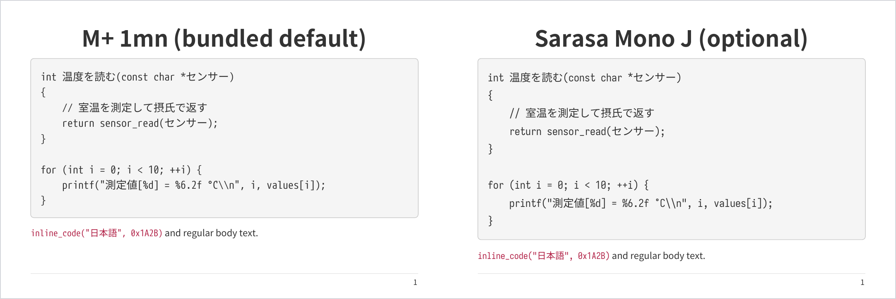

# Space Cubics PDF Builder

This repository is a template for creating PDF documents from AsciiDoc
sources with Asciidoctor PDF.

The included themes and cover designs are provided as Space Cubics samples.
Use them as they are, or adapt them to the requirements of your document.
The template produces a standard PDF and a print-friendly PDF whose cover
uses less solid-color fill.

For examples of AsciiDoc syntax, build the sample document and read the
generated PDF. It covers titles, paragraphs, lists, figures, tables, code
blocks, admonitions, and links.

## Get a first PDF on Debian or Ubuntu

The documented setup uses Bundler to install the Ruby dependencies inside the
repository. Asciidoctor Mathematical includes a native extension, so install
its build requirements together with the tools and packaged fonts used by the
simple theme:

```sh
sudo apt update
sudo apt install \
  make ruby bundler git fonts-ipaexfont-gothic \
  ruby-dev build-essential cmake bison flex \
  libglib2.0-dev libgdk-pixbuf-2.0-dev libcairo2-dev libpango1.0-dev \
  libxml2-dev libffi-dev fonts-lyx
```

`fonts-lyx` supplies the Computer Modern and symbol TTF files used by the
equation renderer.

Clone the repository, keep its gems inside the clone, and build with the simple
theme:

```sh
git clone https://github.com/spacecubics/sc-pdf-builder.git
cd sc-pdf-builder
bundle config set --local path vendor/bundle
CMAKE_POLICY_VERSION_MINIMUM=3.5 \
CMAKE_GENERATOR="Unix Makefiles" \
bundle install
bundle exec make THEME=simple
```

This generates `build/SpaceCubics_PDF_revx.pdf`. The simple theme uses IPAex
Gothic from Debian for body text and M+ 1mn bundled with Asciidoctor PDF for
code. It is intended to make the first build dependable; the Space Cubics
design uses Noto Sans JP and Sarasa Mono J.

`bundle config set --local` writes the setting to `.bundle/config` in this
repository. Both `.bundle/` and `vendor/bundle/` are ignored by Git. No gems
are installed globally. Bundler-generated lock files are also local and
ignored by Git.

Mathematical's bundled CMake files declare compatibility with CMake 2.8.7,
which CMake 4 rejects. `CMAKE_POLICY_VERSION_MINIMUM=3.5` tells current CMake
to apply policies from version 3.5. Mathematical invokes `make` directly after
configuration, so `CMAKE_GENERATOR="Unix Makefiles"` ensures that CMake creates
the Makefiles its installer expects.

Bundler is optional. If you are familiar with Ruby development environments,
install the dependencies declared in `Gemfile` with rbenv, RVM, chruby, a
container, or another preferred workflow. The Makefile invokes Ruby and
Asciidoctor PDF directly, so run the same Make command inside that environment.

## Set up the Space Cubics design

A plain `make` uses the `sc-docs` theme. This is the intended Space Cubics
output:

- Noto Sans JP Regular and Bold for body text
- Sarasa Mono J Regular, Italic, Bold, and Bold Italic for code
- Asciidoctor Mathematical for equations

### Install Noto Sans JP

Debian does not package the standalone static TTF files required by Prawn.
Create Regular and Bold files from Noto's official variable TTF with Debian's
FontTools package:

```sh
sudo apt install curl python3-fonttools fontconfig
font_dir="${XDG_DATA_HOME:-$HOME/.local/share}/fonts"
mkdir -p "$font_dir"
curl -fL \
  -o /tmp/NotoSansJP-VF.ttf \
  https://raw.githubusercontent.com/notofonts/noto-cjk/Sans2.004/Sans/Variable/TTF/Subset/NotoSansJP-VF.ttf
python3 -m fontTools.varLib.instancer --update-name-table -q \
  -o "$font_dir/NotoSansJP-Regular.ttf" \
  /tmp/NotoSansJP-VF.ttf wght=400
python3 -m fontTools.varLib.instancer --update-name-table -q \
  -o "$font_dir/NotoSansJP-Bold.ttf" \
  /tmp/NotoSansJP-VF.ttf wght=700
fc-cache -f "$font_dir"
fc-match -f '%{file}\n' 'Noto Sans JP'
```

Debian's `fonts-noto-cjk` package installs `NotoSansCJK-Regular.ttc` and
`NotoSansCJK-Bold.ttc` under `/usr/share/fonts/opentype/noto`. Those TTC font
collections are not the standalone TTF files required by the theme, and Prawn
cannot use them directly.

### Install Sarasa Mono J

Sarasa Mono J is not available from Debian, RubyGems, or PyPI. Its upstream
project distributes release archives. The same PDF source rendered with M+
and Sarasa looks like this:



To use Sarasa, install its Japanese Mono TTF archive in your per-user font
directory. This example uses version 1.0.41; check the
[Sarasa Gothic releases](https://github.com/be5invis/Sarasa-Gothic/releases)
for a newer version.

```sh
sudo apt install curl 7zip
font_dir="${XDG_DATA_HOME:-$HOME/.local/share}/fonts"
mkdir -p "$font_dir"
curl -fL \
  -o /tmp/SarasaMonoJ-TTF-1.0.41.7z \
  https://github.com/be5invis/Sarasa-Gothic/releases/download/v1.0.41/SarasaMonoJ-TTF-1.0.41.7z
7z x -y /tmp/SarasaMonoJ-TTF-1.0.41.7z \
  -o"$font_dir"
fc-cache -f "$font_dir"
fc-match -f '%{file}\n' 'Sarasa Mono J'
```

The Makefile searches the current XDG user font directory, the legacy
`~/.fonts` directory, `/usr/local/share/fonts`, and Debian's IPAex Gothic
directory. Asciidoctor PDF does not search subdirectories. Override
`FONTS_DIR` when the font files are elsewhere; the supplied value replaces the
complete default search path. Include every directory needed by the selected
theme and separate them with semicolons:

```sh
make FONTS_DIR='/opt/fonts/noto;/opt/fonts/sarasa'
```

Prawn reads and embeds these files directly. Its fallback list supplies a
glyph that the selected, registered font does not contain. It cannot recover
from a missing file named in `font.catalog`; an absent catalog file stops the
build before text is rendered.

### Enable equations

The Gemfile includes Asciidoctor Mathematical, and the Makefile loads it for
every PDF build. Enable equation rendering in a document with:

```asciidoc
:stem: latexmath
:mathematical-format: svg
```

The included example enables both attributes. A document that does not set
`:stem:` builds normally without rendering equations.

## Build the included example

After completing the Space Cubics setup above, build the included example
with:

```sh
bundle exec make
```

The generated file is:

```text
build/SpaceCubics_PDF_revx.pdf
```

Other useful targets are:

```sh
make pdf       # standard PDF only
make pdf-print # print-friendly variant
make clean     # remove generated files
```

### Print-friendly variant

Build the print-friendly PDF explicitly:

```sh
bundle exec make pdf-print
```

This generates `build/SpaceCubics_PDF_revx-print.pdf`. It has a white cover
with dark text and logo artwork, reducing toner or ink use. The standard PDF
has a dark cover with white text and logo artwork. The document body is the
same in both variants.

### Configure the build

`Makefile_sample` supplies the following variables. Override a variable on the
command line for a single build, or set its value in the document repository's
`Makefile` to make the setting permanent.

- `PDF_BUILDER` is the path to the cloned builder. Its default is
  `sc-pdf-builder`.
- `ADOC_SOURCE` is the entry-point `.adoc` file. Its default is
  `src/index.adoc`. All `.adoc` files in its directory and subdirectories are
  build dependencies.
- `IMAGES_DIR` is the directory used for `image::` references. Its default is
  `images`.
- `OUTPUT` is the base name of the generated PDFs, without the `.pdf`
  extension. Its default is `document`.
- `BUILD_DIR` is the output directory. Its default is `build`.

For example, build a document whose source and images are in custom locations:

```sh
make pdf ADOC_SOURCE=docs/manual/manual.adoc \
  IMAGES_DIR=docs/assets OUTPUT=My_Document
```

This command generates `build/My_Document.pdf`. The same settings apply to
the print-friendly PDF and both PDF variants:

```sh
make print OUTPUT=My_Document
make all OUTPUT=My_Document
```

To store generated files in another directory, override `BUILD_DIR`:

```sh
make all BUILD_DIR=output
```

The previous commands generate the following files when `OUTPUT` is
`My_Document`:

```text
build/My_Document.pdf
build/My_Document-print.pdf
```
